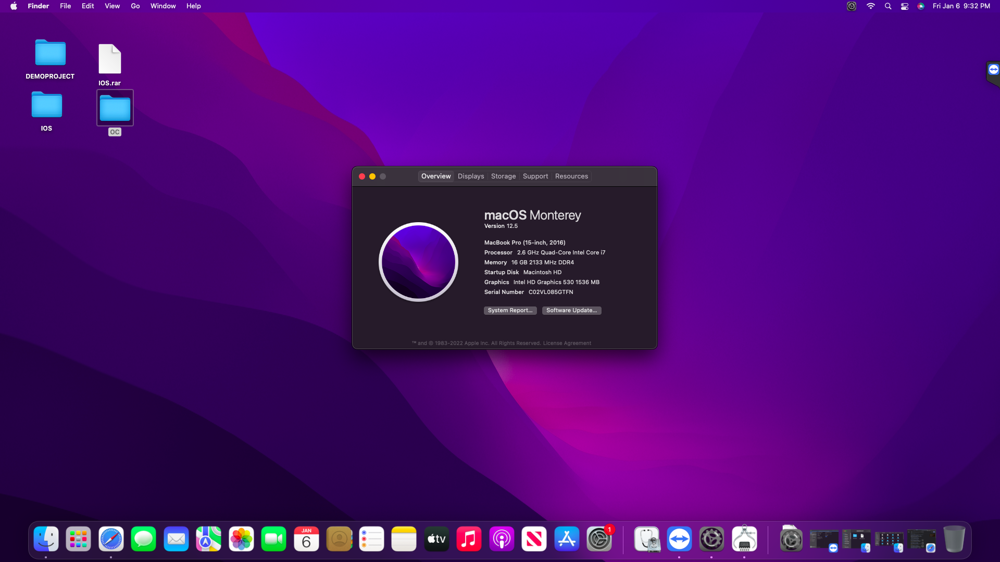

# <div align="center">Dell Inspiron 7566 hackintosh
</div> 


## Bootloader Versions

|OpenCore|
|--------|
|0.8.7|

## Supported macOS Versions

- Catalina
- Big Sur
- Monterey
- Ventura (Many errors, change SMBIOS)

```Note:``` 
- MacOs Ventura need to change Wifi Kext(v2.2.0-alpha-1/6/2023-m/dd/yyyy) [Click here](https://github.com/OpenIntelWireless/itlwm/releases)
- Use [OpenCore Legacy Patcher](https://github.com/dortania/OpenCore-Legacy-Patcher/releases) to fix iGPU in Ventura.

## Screenshots

<div align="center">
  

   
</div>

## Laptop Specification
 
|                     | Specifications| Note |
| ---------------------------- | ---------------------- |------------------|
| ``Chipset``| Intel Sunrise Point HM170, Intel Skylake-H |   |
| ``CPU``| Intel® Core™ i5-6300HQ 3.20 GHz | |
| ``Memory``| 8 GB DDR4-2400 | 2 x 8GB |
| ``iGPU``| Intel(R) HD Graphics 530 | With full QE/CI (Graphics accleration). |
| ``Screen``| 15.4" LCD 1920x1080 | BOEhydis NV15N41 (Dell YHDGT) |
| ``Ethernet``| Realtek PCIe GbE Family Controller | Use [RealtekRTL8111](https://github.com/Mieze/RTL8111_driver_for_OS_X/releases). |
| ``WiFi and Bluetooth``| 	Intel(R) Dual Band Wireless-AC 3165 | Use [AirportItlwm](https://github.com/OpenIntelWireless/itlwm/releases) for Wifi and [IntelBluetoothFirmware](https://openintelwireless.github.io/IntelBluetoothFirmware/) for Bluetooth. | 
| ``Audio``| Realtek ALC256 | Add `alcid=13` to boot-arg or add layout-id to DeviceProperties. |
| ``Keyboard``| - | -. |
| ``Touchpad``| Dell Touchpad (I2C HID) |  |
| ``Battery``| Die | |

  


## Features


|                               | OpenCore             | 
| ----------------------------- | -------------------- | 
| ``Wifi and Bluetooth``|✅|
| ``Audio``|✅|
| ``Keyboard and Trackpad``|✅|
| ``Headphone Jack``|✅|
| ``Graphics``|✅|
| ``Battery``|✅|
| ``Card Reader``|✅|
| ``Power Management``|✅|
| ``Multigesture Trackpad``|✅|                                                                        
| ``Webcam``|✅|
| ``USB Port``|✅|
| ``Facetime and iMessage``|✅|
| ``Sleep``|✅|
| ``Ethernet``|✅|
| ``Hotkeys``|✅|

# Thanks
- [Apple](https://apple.com) for macOS.
- Acidanthera, SkyrilHD, etc. for all the kext.
- [NLTD2010](https://github.com/NLTD2010) and [Olarila](https://olarila.com) for my EFI folders.
- [khanhmuy](https://github.com/khanhmuy) for my README file.
